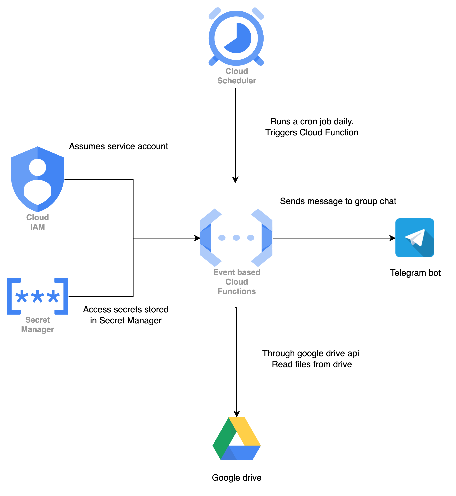

# Google Cloud Function for Chapter Upload Notification

This Google Cloud Function project is designed to notify a Telegram chat about chapters that need to be uploaded to Google Drive on a daily basis. The function is triggered daily by a cron job that runs on cloud scheduler. 

## Requirements
- Node.js (v14 or later)
- npm (Node Package Manager)
- [Google Cloud Functions Framework](https://cloud.google.com/functions/docs/functions-framework)
- [Google APIs Client Library](https://developers.google.com/drive/api/guides/about-sdk) 
- Node Telegram Bot API

## Installation

1. Clone the repository:

    ```bash
    git clone https://github.com/corliss5156/serverless-upload
    ```

2. Install dependencies:

    ```bash
    cd your-repository
    npm install
    ```

3. Set up a Telegram bot and obtain the bot token. [Step by step guide](https://core.telegram.org/bots/features#creating-a-new-bot). 
The bot was added to a group chat and must have permissions to send messages to the telegram group. 

Add the bot to your chat and obtain the chat ID.

4. Set up Google Cloud Platform (GCP) project, enable the Google Drive API, and create credentials for the service account. Ensure the service account has the necessary permissions to access Google Drive.

5. Configure environment variables by creating a `.env` file with the following content. You only need this for local testing. Otherwise, just follow the Secret Manager section. 

    ```plaintext
    BOT_TOKEN=your-telegram-bot-token
    CHAT_ID=your-telegram-chat-id
    ```

## Architecture 


## Local testing
We definitely want to test our function directly in our development environment. While the deployed function will assume the service account as its identity when running on the cloud, we will need to take the following steps to test the function locally. 

1) Functions Framework 
This is a library that wraps the cloud function in a persistent http application. Install the functions framework 
    ```
    npm install --save-dev @google-cloud/functions-framework
    ```

Specify the function's name in the start script of package.json: 
```
    "scripts": {
        "start": "npx functions-framework --target=chapter"
    }
```

In the Google Cloud Console, obtain a credentials.json file of your function's service account. [Guide](https://cloud.google.com/iam/docs/keys-create-delete)

- Grab the service account of your function in the 'Details' tab of the Cloud Function
- Under IAM & Admin, locate the service account, it should be of the form '***@***.iam.gserviceaccount.com' and go to 'Manage Keys' from the 'Actions' tab. 

After downloading the key, it should be saved as a json file in the root of your project. Export the environment variable
```
export GOOGLE_APPLICATION_CREDENTIALS="/path/to/your/service-account-key.json"
```

Run npm start in the root of your project. The function will start as a http application that defaults to port 8080 of localhost. 
```
npm start
```

Send a Test Request
```
curl localhost:8080 -X POST -d '{"key": "value"}'
```

## Allowing the Cloud Function to access Google Drive 

Not even going to dump the link to the Google Drive Documentation page because there is nothing there that is useful for this section. Anyway, heres what you got to do: 

1. Inside the google drive you want to share with the Cloud Function, hit the down arrow and share. 

2. Grab the service account of the Cloud Function and add it as a viewer for the Drive. 

3. If the Google Drive you are sharing is a shared drive, add the following parameters to the drive.files.list call 
    ```
        includeItemsFromAllDrives: true, 
        supportsAllDrives: true
    ```
    If this step is not done, the API call will stil return a success response but the data.files will be an empty array 

## Secret Manager 

Obviously, we don't want to expose our secrets regarding the BOT_TOKEN and CHAT_ID anywhere so we are using [Google Secret Manager](https://cloud.google.com/secret-manager/docs/create-secret-quickstart) and allowing our functions to read the secrets stored there. 

After creating the secrets, you will need to allow the Cloud Function access to the secrets. 
[Grand access to Cloud Function](https://cloud.google.com/functions/docs/configuring/secrets)
The 'email address(es) of the members to add.' is just your Cloud Function's service account. This step only allows the Cloud Function to access the secrets stored on Secrets Manager. 


## Functionality

The Cloud Function performs the following steps:

1. Authenticate with Google Drive using the provided credentials and scopes.

2. Retrieve the ID of the "Uploaded" folder in Google Drive.

3. List files in Google Drive that match the criteria (files with names starting with "Chapter" and not in the "Uploaded" folder).

4. Identify chapters to be uploaded today based on the current date and a predefined target date.

5. Check if the identified chapters have already been uploaded to Google Drive.

6. Notify the Telegram chat about any chapters that have not been uploaded today.

## Additional Information

- The `getTodaysChapters` function calculates the chapters to be uploaded today based on the difference between the current date and a target date.

- The `getChapterNumber` function extracts the chapter number from a file name.

- The Telegram bot sends a notification message to the specified chat ID, indicating the chapters that need to be uploaded or confirming that all chapters have been uploaded.